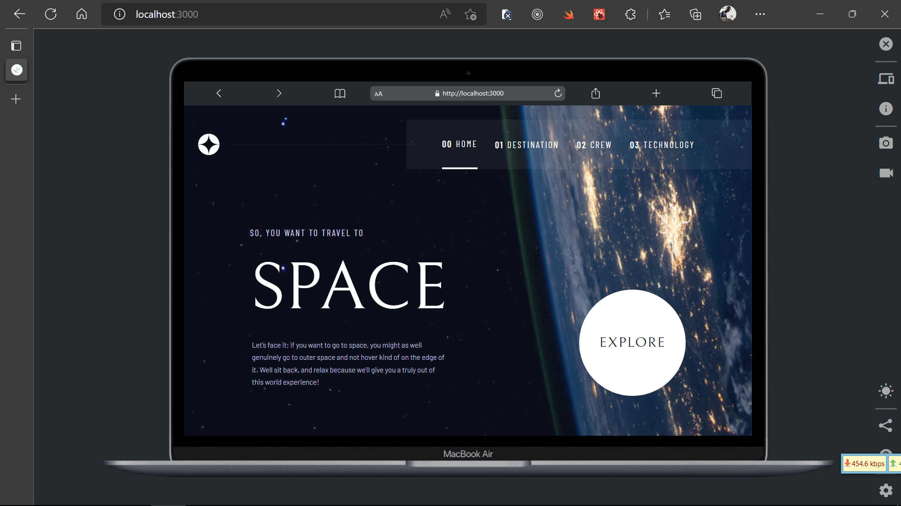

# Frontend Mentor - Space tourism website solution

This is a solution to the [Space tourism website challenge on Frontend Mentor](https://www.frontendmentor.io/challenges/space-tourism-multipage-website-gRWj1URZ3). Frontend Mentor challenges help you improve your coding skills by building realistic projects.

## Table of contents

- [Overview](#overview)
  - [The challenge](#the-challenge)
  - [Screenshot](#screenshot)
  - [Links](#links)
- [My process](#my-process)
  - [Built with](#built-with)
  - [What I learned](#what-i-learned)
  - [Continued development](#continued-development)
  - [Useful resources](#useful-resources)
- [Author](#author)
- [Acknowledgments](#acknowledgments)

## Overview

### The challenge

Users should be able to:

- View the optimal layout for each of the website's pages depending on their device's screen size
- See hover states for all interactive elements on the page
- View each page and be able to toggle between the tabs to see new information

### Screenshot



### Links

- Solution URL: [GitHub Repository for Space Tourism Website Solution](https://github.com/Eddiebee/space-tourism)
- Live Site URL: [Live Site URL for Space Tourism Website Solution](https://space-tourism-bice.vercel.app/)

## My process

### Built with

- React JS
- TypeScript
- Tailwind CSS
- React-router v6
- Mobile-first workflow
- [React](https://reactjs.org/) - JS library
- [React Router v6](https://reactrouter.com/) - For programmatic and dynamic routing
- [Tailwind CSS](https://tailwindcss.com/) - For styles

### What I learned

- Programmatic routing using react-router

```jsx
<Routes>
  <Route path="/" element={<Layout />}>
    <Route index element={<Home />} />
    <Route path="destination" element={<DestinationLayout />}>
      <Route index element={<Destination />} />
      <Route path=":destination" element={<DestinationDetail />} />
    </Route>
    <Route path="crew" element={<CrewLayout />}>
      <Route index element={<Crew />} />
      <Route path=":crew" element={<CrewDetail />} />
    </Route>
    <Route path="technology" element={<TechnologyLayout />}>
      <Route index element={<Technology />} />
      <Route path=":technology" element={<TechnologyDetail />} />
    </Route>
  </Route>
</Routes>
```

- Dynamic routing using react-router v6

```jsx
import { Navigate } from "react-router-dom";

const Destination = () => {
  return <Navigate to="/destination/moon" replace={true} />;
};

export default Destination;
```

- Tailwind CSS Configuration

```js
/** @type {import('tailwindcss').Config} */

module.exports = {
  content: ["./src/**/*.{js,jsx,ts,tsx}"],
  theme: {
    extend: {
      colors: {
        dark: "#0B0D17",
        primary: "#ffffff",
        secondary: "#D0D6F9",
        selection: "#383B4B",
      },
      fontFamily: {
        bellefair: ["Bellefair", "serif"],
        barlow: ["Barlow", "sans-serif"],
        "barlow-condensed": ["Barlow Condensed", "sans-serif"],
      },
      animation: {
        "spin-slow": "spin 80s linear infinite",
      },
    },
  },
  plugins: [],
};
```

### Continued development

- I'll be focusing on applying Context API provided by React for more advanced data sharing across apps.
- I'll be building out more projects with Next JS (a React framework that makes building fullstack React Apps a breeze).
- Also, using TypeScript helped me write code with less bugs and more predicatable across data being used in the App, so I'll be usinh it in all projects from now.

### Useful resources

- [TypeScript docs](https://www.typescriptlang.org/docs/) - This helped me catch up with the errors I was having using Static typing and error detection, though it can be really time-consuming but I know it's worth the reduced bugs in the codebase and also helps in writing self-documented code (easier) to understand across teams and no need for PropTypes in React lol...
- [React Router docs](https://reactrouter.com/docs/en/v6) - This docs are well explained and helped me implement v6 of react router even when I had no prior experience building with it. Thanks to the great team behind the scenes.

## Author

- Website - [Eddie (eddiebee) Bassey Otudor](https://github.com/Eddiebee)
- Frontend Mentor - [@Eddiebee](https://www.frontendmentor.io/profile/Eddiebee)
- Twitter - [@eddie_otudor](https://www.twitter.com/eddie_otudor)
- Instagram - [@realeddiebee](https://www.instagram.com/realeddiebee/)
- LinkedIn - [@eddieotudor](https://www.linkedin.com/in/eddieotudor/)

## Acknowledgments

I thank GOD for the strength, creativity and the passion to build simple solutions. I know this is just the beginning. Thank you Frontend Mentor, much love to the amazing team over there, GOD bless y'all!
